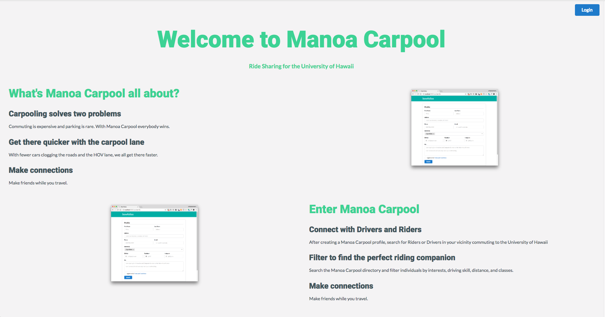
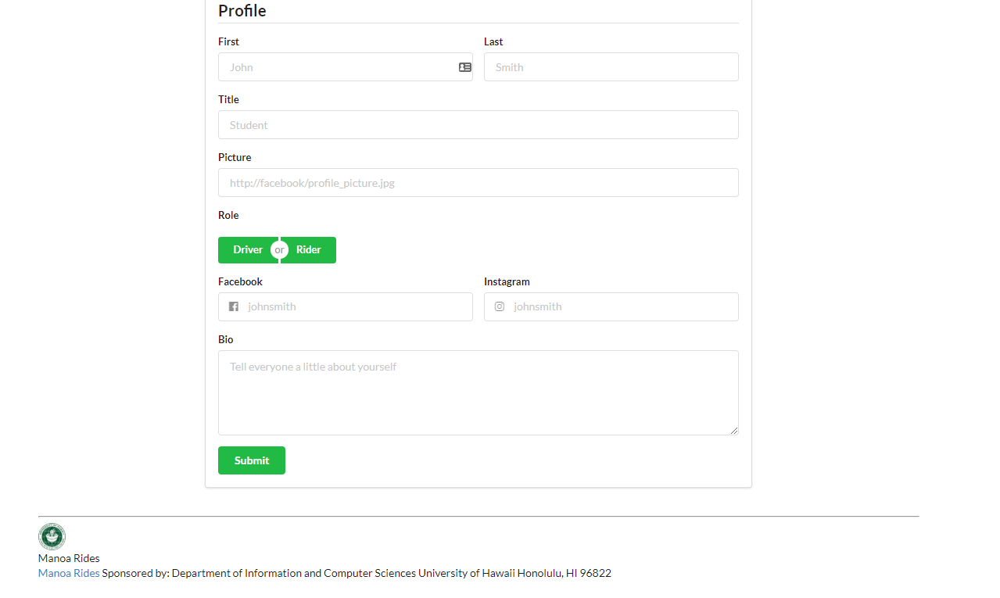
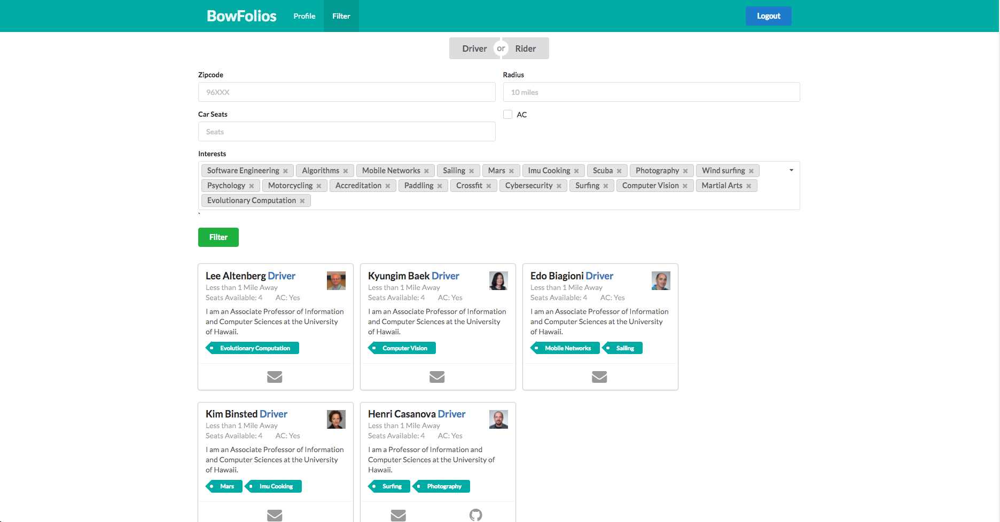

[Check out the App](https://manoa-rides.meteorapp.com)

[Check out our GitHub](https://github.com/manoa-rides)

# Table of contents

* [About Manoa Rides](#about-bowfolios)
* [Development history](#development-history)
  * [Milestone 1: Mockup development](#milestone-1-mockup-development)

# About Manoa Rides 

## What's Manoa Carpool all about?
### Carpooling solves two problems

Commuting is expensive and parking is rare. With Manoa Carpool everybody wins.

### Get there quicker with the carpool lane

With fewer cars clogging the roads and the HOV lane, we all get there faster.

### Make connections

Make friends while you travel.

## Enter Manoa Carpool
### Connect with Drivers and Riders

After creating a Manoa Carpool profile, search for Riders or Drivers in your vicinity commuting to the University of Hawaii

### Filter to find the perfect riding companion

Search the Manoa Carpool directory and filter individuals by interests, driving skill, distance, and classes.

### Make connections

Make friends while you travel.

# Development History

The development process for Manoa-Rides

## Milestone 1: Mockup development

This milestone started on November 14, 2017 and ended on November 22, 2017.

For milestone 1 the goal was to get mockups off all the page we wanted, and get an idea of what the completed application would look like.  

Mockups for the following four pages were implemented during M1:

Milestone 1 was implemented as [Manoa-Rides GitHub Milestone M1](https://github.com/manoa-rides/manoa-rides/milestones)::

Milestone 1 consisted of nine issues, and progress was managed via the [Manoa-Rides GitHub Project M1](https://github.com/manoa-rides/manoa-rides/projects/1):

Each issue was implemented in its own branch, and merged into master when completed:

