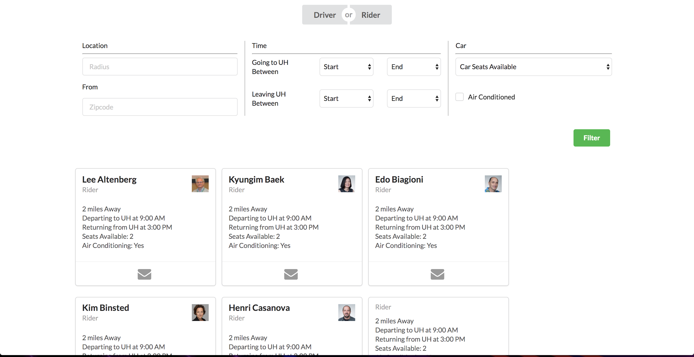
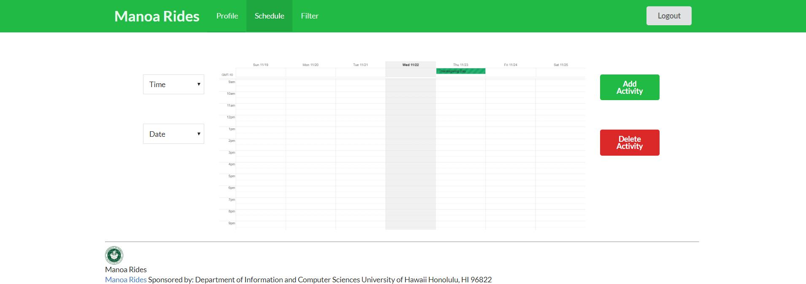

View the live [App](https://manoa-rides.meteorapp.com) 

Check out our [GitHub](https://github.com/manoa-rides)
 
   
# Table of contents

* [Overview of Manoa Rides](#about-manoa-rides)
* [User Guide](#user-guide)
* [Developer Guide](#user-guide)
 * [Installation](#installation)
  * [Branches](#branches)
  * [Meteor Website](#meteor-website)
 * [Application design](#application-design)
   * [Directory structure](#directory-structure)
   * [Import conventions](#import-conventions)
   * [Naming conventions](#naming-conventions)
   * [Data model](#data-model)
   * [CSS](#css)
   * [Routing](#routing)
   * [Authentication](#authentication)
   * [Authorization](#authorization)
   * [Configuration](#configuration)
   * [Redeploy Meteor](#redeploy-meteor)
   * [ESLint](#eslint)
* [Development history](#development-history)
  * [Initial Mockup Pages](#initial-mockup-pages)
  * [Milestone 1: Mockup development](#milestone-1-mockup-development)
  * [Milestone 2](#milestone-2)
* [Community Feedback](#community-feedback)


# About Manoa Rides 

## What's Manoa Carpool all about?
### Carpooling solves two problems

Commuting is expensive and parking is rare. With Manoa Carpool everybody wins.

### Get there quicker with the carpool lane

With fewer cars clogging the roads and the HOV lane, we all get there faster.

### Make connections

Make friends while you travel.


## Enter Manoa Carpool
### Connect with Drivers and Riders

After creating a Manoa Carpool profile, search for Riders or Drivers in your vicinity commuting to the University of Hawaii

### Filter to find the perfect riding companion

Search the Manoa Carpool directory and filter individuals by interests, driving skill, distance, and classes.

### Make connections

Make friends while you travel.







# Installation

First, [install Meteor](https://www.meteor.com/install).

Second, [download a copy of Manoa-Rides](https://github.com/manoa-rides/manoa-rides/archive/master.zip), or clone the [repository](https://github.com/manoa-rides/manoa-rides/) using git.
  
Third, cd into the app/ directory and install libraries with:

```
$ meteor npm install
```

Fourth, run the system with:

```
$ meteor npm run start
```

If all goes well, the application will appear at [http://localhost:3000](http://localhost:3000). If you have an account on the UH test CAS server, you can login.  

# User Guide

After logging in, you will be directed to Create/Edit profile page. At the Profile Page you can specify things you full name, whether you are posting as a rider to a driver, a picture of yourself, the capacity of your car, a picture of your car, a short biograph, and the zip code in which you live.  To edit this page in the future simply click on the profile tab. 

To search for Drivers or Riders click on the Drivers or Riders tab. At the Search for Drivers or Riders page you can search for Drivers or Riders and filter based on time they commute, their zip code, and if they are a driver the number of seats they have in their car. 

On the Scheduling page,

# Developer guide 

### Branches

When creating a new branch for the project use issue-XX naming conventions. This way branches can be directly tied to the issue they correspond to. 

```
$ git checkout -b issue-XX
```

Make sure that master always has working code. 

To change branches:

```
$ git checkout [issue-XX or master]
```

Make sure to:

```
$ git pull
```

frequently from the master branch. This assures that you will have the most recent working code from other people. 


### Meteor Website

To use and make a meteor app website, first create an account on the [Galaxy website](https://galaxy.meteor.com/) After creating an account it will be costly to push any website onto galaxy so it's best to work with an organization that has limited slots but will be able to push your website for free. 

For more instructions, please at [E54: Test deploy to Galaxy](http://courses.ics.hawaii.edu/ics314s17/morea/deployment/experience-test-deployment.html)

## Directory structure

The top-level directory structure contains:

```
app/        # holds the Meteor application sources
config/     # holds configuration files, such as settings.development.json
.gitignore  # don't commit IntelliJ project files, node_modules, and settings.production.json
```

This structure separates configuration files (such as the settings files) in the config/ directory from the actual Meteor application in the app/ directory.

The app/ directory has this top-level structure:

```
client/
  lib/           
  head.html      # the <head>
  main.js        # import all the client-side html and js files (important if creating or deleting any directories)

imports/
  api/           # Define collection processing code (client + server side)
    base/        # BaseCollection is an abstract superclass of all RadGrad data model entities.
    eventdata/   # Represents specific eventdata.
    profile/     # Profiles provide portfolio data for a user.
    user_accepted_listings/
  startup/       # Define code to run when system starts up (client-only, server-only)
    client/      # Contains the router and user account-configuration.js page to link other pages
    server/      # Initializes the database and publish the interest and profiles.
  ui/
    components/  # templates that appear inside a page template.
    layouts/     # Layouts contain common elements to all pages (i.e. menubar and footer)
    pages/       # Pages are navigated to by FlowRouter routes.
    stylesheets/ # CSS customizations, if any.

node_modules/    # managed by Meteor

private/
  database/      # holds the JSON file used to initialize the database on startup.

public/          
  images/        # holds static images for the website
  
server/
   main.js       # import all the server-side js files.
```

### Import conventions

This system adheres to the Meteor 1.4 guideline of putting all application code in the imports/ directory, and using client/main.js and server/main.js to import the code appropriate for the client and server in an appropriate order.

This system accomplishes client and server-side importing in a different manner than most Meteor sample applications. In this system, every imports/ subdirectory containing any JavaScript or HTML files has a top-level index.js file that is responsible for importing all files in its associated directory.   

Then, client/main.js and server/main.js are responsible for importing all the directories containing code they need. For example, here is the contents of client/main.js:

```
import '/imports/startup/client';
import '/imports/ui/components/form-controls';
import '/imports/ui/components/directory';
import '/imports/ui/components/user';
import '/imports/ui/components/landing';
import '/imports/ui/layouts/directory';
import '/imports/ui/layouts/landing';
import '/imports/ui/layouts/shared';
import '/imports/ui/layouts/user';
import '/imports/ui/pages/directory';
import '/imports/ui/pages/filter';
import '/imports/ui/pages/schedule';
import '/imports/ui/pages/landing';
import '/imports/ui/pages/user';
import '/imports/ui/stylesheets/style.css';
import '/imports/api/base';
import '/imports/api/profile';
import '/imports/api/interest';
```

Apart from the last line that imports style.css directly, the other lines all invoke the index.js file in the specified directory.

We use this approach to make it simpler to understand what code is loaded and in what order, and to simplify debugging when some code or templates do not appear to be loaded.  In our approach, there are only two places to look for top-level imports: the main.js files in client/ and server/, and the index.js files in import subdirectories. In those subdirectories, they usually will contain any html, CSS and JavaScript files that the subdirectories will use. 

Note that this two-level import structure ensures that all code and templates are loaded, but does not ensure that the symbols needed in each file are accessible.  So, for example, a symbol bound to a collection still needs to be imported into any file that references it. 
 
### Naming conventions

This system adopts the following naming conventions:

  * Files and directories are named in all lowercase, with words separated by hyphens. Example: accounts-config.js
  * "Global" JavaScript variables (such as collections) are capitalized. Example: Profiles.
  * Other JavaScript variables are camel-case. Example: collectionList.
  * Templates representing pages are capitalized, with words separated by underscores. Example: Directory_Page. The files for this template are lower case, with hyphens rather than underscore. Example: directory-page.html, directory-page.js.
  * Routes to pages are named the same as their corresponding page. Example: Directory_Page.

### Data model

The Manoa-Rdies data model is implemented by mainly using a Javascript class: [ProfileCollection](https://github.com/manoa-rides/manoa-rides/tree/master/app/imports/api/profile) this class encapsulates a MongoDB collection with the same name and export a single variable Profiles that provides access to that collection. 

### CSS

The application uses the [Semantic UI](http://semantic-ui.com/) CSS framework. To learn more about the Semantic UI theme integration with Meteor, see [Semantic-UI-Meteor](https://github.com/Semantic-Org/Semantic-UI-Meteor).

The Semantic UI theme files are in [app/client/lib/semantic-ui](https://github.com/ics-software-engineering/meteor-application-template/tree/master/app/client/lib/semantic-ui) directory. Because they are in the client/ directory and not the imports/ directory, they do not need to be explicitly imported to be loaded. (Meteor automatically loads all files into the client that are in the client/ directory). 

Note that the user pages contain a menu fixed to the top of the page, and thus the body element needs to have padding attached to it.  However, the landing page does not have a menu, and thus no padding should be attached to the body element on that page. To accomplish this, the [router](https://github.com/manoa-rides/manoa-rides/blob/master/app/imports/startup/client/router.js) uses "triggers" to add a remove the appropriate classes from the body element when a page is visited and then left by the user. 

List of some of the Semantic UI used in this project:
-Images
-Accordion
-Item
-Grid
-Container
-Table


### Routing

For display and navigation among its four pages, the application uses [Flow Router](https://github.com/kadirahq/flow-router).

Routing is defined in [imports/startup/client/router.js](https://github.com/ics-software-engineering/meteor-application-template/blob/master/app/imports/startup/client/router.js).

Manoa Rides defines the following routes:

  * The `/` route goes to the public landing page.
  * The `/directory` route goes to the public directory page.
  * The `/<user>/profile` route goes to the profile page associated with `<user>`, which is the UH account name.
  * The `/<user>/filter` route goes to the filter page associated with `<user>`, which is the UH account name.

### Authentication

For authentication, the application uses the University of Hawaii CAS test server, and follows the approach shown in [meteor-example-uh-cas](http://ics-software-engineering.github.io/meteor-example-uh-cas/).

When the application is run, the CAS configuration information must be present in a configuration file such as [config/settings.development.json](https://github.com/ics-software-engineering/meteor-application-template/blob/master/config/settings.development.json). 

Anyone with a UH account can login and use Manoa Rides to create a portfolio. The user will then create their own profile and image (and car image) to gain further access. 

### Authorization

The landing and directory pages are public; anyone can access those pages.

The profile and filter pages require authorization: you must be logged in (i.e. authenticated) through the UH test CAS server, and the authenticated username returned by CAS must match the username specified in the URL.  So, for example, only the authenticated user `johnson` can access the pages `http://localhost:3000/johnson/profile` and `http://localhost:3000/johnson/filter`.

To prevent people from accessing pages they are not authorized to visit, template-based authorization is used following the recommendations in [Implementing Auth Logic and Permissions](https://kadira.io/academy/meteor-routing-guide/content/implementing-auth-logic-and-permissions). 

The application implements template-based authorization using an If_Authorized template, defined in [If_Authorized.html](https://github.com/manoa-rides/manoa-rides/blob/master/app/imports/ui/layouts/user/if-authorized.html) and [If_Authorized.js](https://github.com/manoa-rides/manoa-rides/blob/master/app/imports/ui/layouts/user/if-authorized.js).

## Configuration

The [config](https://github.com/bowfolios/bowfolios/tree/master/config) directory is intended to hold settings files.  The repository contains one file: [config/settings.development.json](https://github.com/manoa-rides/manoa-rides/blob/master/config/settings.development.json).

The [.gitignore](https://github.com/manoa-rides/manoa-rides/blob/master/.gitignore) file prevents a file named settings.production.json from being committed to the repository. So, if you are deploying the application, you can put settings in a file named settings.production.json and it will not be committed.

BowFolios checks on startup to see if it has an empty database in [initialize-database.js](https://github.com/manoa-rides/manoa-rides/blob/master/app/imports/startup/server/initialize-database.js), and if so, loads the file specified in the configuration file, such as [settings.development.json](https://github.com/manoa-rides/manoa-rides/blob/master/config/settings.development.json).  For development purposes, a sample initialization for this database is in [initial-collection-data.json](https://github.com/manoa-rides/manoa-rides/blob/master/app/private/database/initial-collection-data.json).

### Redeploy Meteor

Sometimes after editing fields in the profile field, or using new packages you may not be able to run the app on localhost in those cases this command sequence can help solve some errors:

```
meteor npm reset
meteor npm install
meteor npm run start
```

This should reset your local mongo and update your installed modules.

### ESLint

BowFolios includes a [.eslintrc](https://github.com/manoa-ridesmanoa-rides/manoa-rides/blob/master/app/.eslintrc) file to define the coding style adhered to in this application. You can invoke ESLint from the command line as follows:

```
meteor npm run lint
```

ESLint should run without generating any errors.  

It's significantly easier to do development with ESLint integrated directly into your IDE (such as IntelliJ).

# Development History

The development process for Manoa-Rides

## Milestone 1: Mockup development

This milestone started on November 14, 2017 and ended on November 22, 2017.

For milestone 1 the goal was to get mockups off all the page we wanted, and get an idea of what the completed application would look like.  

Mockups for the following four pages were implemented during M1:

### Schedule Mockup


### Profile Mockup


### Landing Mockup


### Filter Mockup


Milestone 1 was implemented as [Manoa-Rides GitHub Milestone M1](https://github.com/manoa-rides/manoa-rides/milestones):


Milestone 1 consisted of nine issues, and progress was managed via the [Manoa-Rides GitHub Project M1](https://github.com/manoa-rides/manoa-rides/projects/1):


Each issue was implemented in its own branch, and merged into master when completed:


## Milestone 2: Implementing and Improving Functionality

This milestone started on November 23, 2017 and ended on December 13, 2017.

For Milestone 2 the goal was to take the page that we created in Milestone 1 and implement the fundamental functionality.

Four pages were implemented during M2:

### Implemented Schedule Page 


### Implemented Profile Page


### Implemented Filter Page 


### Implemented Landing Page 


Milestone 2 was implemented as [Manoa-Rides GitHub Milestone M2](https://github.com/manoa-rides/manoa-rides/milestone/2):


Milestone 2 consisted of 23 issues, and progress was managed via the [Manoa-Rides GitHub Project M2](https://github.com/manoa-rides/manoa-rides/projects/2):


Each issue was implemented in its own branch (unless it took less than 20 minutes to complete), and merged into master when completed:


## Community Feedback

After asking some of our friends, all outside of the computer science field to try out our app we came away with seven main points. 
1.	All of them were not aware the UH had a carpooling system or application in place. 
2.	Six out of the ten people asked used their own vehicle to drive to school. The other four used the bus. 
3.	Most people both departed to school and returned home on a very regular weekly schedule. 
4.	Motivations for potentially using the carpooling system were, in order, reducing transit time, reducing transit cost, and reducing pollution. 
5.	When asked how they would carpool if they hadn’t known about out app most said asking around. 
6.	When asked if they would use our app for carpooling all of them said they would use our application only if it had a significant number of users and that finding those individuals was easy. 
7.	They felt there was more incentive to be a rider than a driver. When we asked what kind of incentive would have to be put in place for the drivers most indicated that it would have to be monetary, not necessarily enough to produce a profit, but rather to offset gas and parking costs. 
